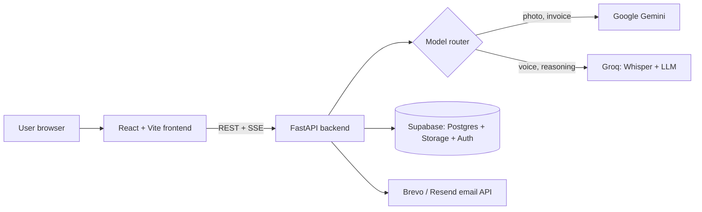
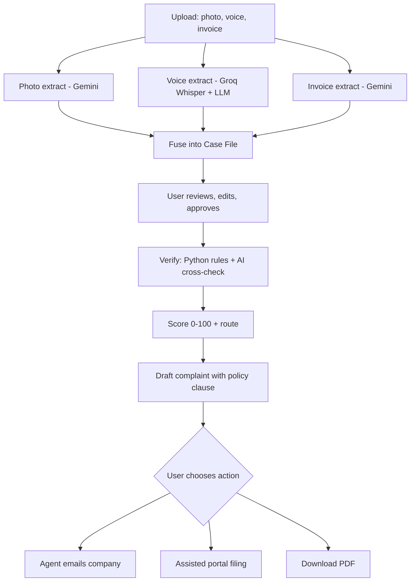

# ClaimKaro: the AI agent that fights your refund for you

> Upload a photo of the damage, a voice note and your invoice. ClaimKaro connects all three, checks the evidence for contradictions, scores your claim, and drafts a policy-backed complaint in about a minute.

**Theme:** Multimodal AI · NIAT Hackathon 2026

| | Link |
|---|---|
| 🌐 Live app | https://claimkaro-jhet.onrender.com |
| ⚙️ Backend API | https://claimkaro-api-wuh1.onrender.com/health |
| 🎬 Demo video | _add link_ |

> The backend runs on Render's free tier and sleeps when idle. If the first request is slow, open the backend `/health` link once and wait about 50 seconds.

---

## 1. Problem statement

Online shoppers in India regularly receive defective, damaged or wrong products, but getting a refund or replacement is slow and frustrating. Customers have to collect evidence, find their invoice, work out whether they are still inside the return window or the warranty period, and write a convincing complaint, all while dealing with customer care that often stalls. Most people don't know their rights under the Consumer Protection Act, 2019, and many simply give up.

The evidence they hold (a photo of the damage, their own description of the problem, and an invoice) sits in separate formats that no existing tool connects or checks.

## 2. Solution

ClaimKaro is a **multimodal AI agent**. It reads an image, an audio note and a document, fuses them into a single **Case File**, verifies the evidence against each other and against brand and platform policies, and then acts: it emails the company, guides filing on the complaint portal, or produces a ready-to-send PDF.

### How it works

1. **Upload:** a defect photo, a voice note (recorded in the browser, Hindi or English) and the invoice (PDF or image).
2. **Multimodal extraction:** three AI calls run **in parallel**:
   - **Photo → Gemini vision:** product, color, defect type, and a bounding box around the damage.
   - **Voice → Groq Whisper + LLM:** transcript, complaint summary, and the outcome the customer wants.
   - **Invoice → Gemini document understanding:** order ID, purchase date, price, seller, platform.
3. **Fuse:** everything merges into one Case File. Every field records its **source** (photo, voice or invoice) and a **confidence** score.
4. **Human review:** the user checks and edits the Case File. Low-confidence fields are highlighted, and nothing continues without approval.
5. **Verify:** Python rules calculate the exact days since purchase and check the return window and warranty against `data/policies.json`. An AI cross-check then looks for contradictions between the evidence (for example, the invoice says *Black* but the photo shows *Blue*).
6. **Score and route:** an explainable claim strength (0 to 100) and the best route: return, replacement, warranty claim, or consumer helpline.
7. **Draft and act:** a formal complaint citing the relevant policy clause. The user chooses to have the agent **email the company** (evidence attached), get **assisted portal filing** (pre-filled fields with copy buttons), or **download a PDF**.

Every step streams to a **live timeline** in the UI, so you can watch the agent work.

### Key features

- **True multimodal reasoning:** image, audio and document are connected into one case, not processed in isolation.
- **Contradiction detector:** flags inconsistent evidence before anything is sent.
- **Defect highlighting:** draws the AI's bounding box over the damage in the photo.
- **Live agent timeline:** Server-Sent Events stream each step as it runs.
- **Model routing with fallback:** Gemini for vision, Groq for speech and reasoning. If one provider fails or is overloaded, the router falls back automatically.
- **Hallucination-safe facts:** dates, return windows and warranty periods are calculated in Python, never by the AI. The AI writes the wording, and Python checks that the order ID and date in the draft are correct.
- **Human in the loop:** the user approves the Case File and confirms before any email is sent.
- **Case tracking:** every claim is saved with its status, score and route.

---

## 3. Architecture



### Agent pipeline



---

## 4. Tech stack

| Layer | Technology |
|---|---|
| Frontend | React 19, Vite, React Router, Tailwind CSS, Axios, `@microsoft/fetch-event-source`, lucide-react |
| Backend | Python 3.12, FastAPI, Uvicorn, Pydantic v2, `sse-starlette` |
| AI | Google Gemini (`google-genai`), Groq (Whisper large-v3, GPT-OSS 120B) |
| Database and storage | Supabase (PostgreSQL with Row Level Security, Storage, Auth) |
| Email | Brevo transactional API (or Resend) |
| PDF | ReportLab |
| Deployment | Render (backend web service + frontend static site) |

All AI API keys live **only in backend environment variables**. The frontend never sees them.

---

## 5. Project structure

```
CLAIM-KARO/
├── backend/
│   ├── main.py                # FastAPI app, CORS, routers
│   ├── config.py              # settings loaded from .env
│   ├── auth.py                # Supabase JWT verification (+ dev mode)
│   ├── db.py                  # Supabase client
│   ├── router.py              # model router: vision(), transcribe(), reason() with fallback
│   ├── schemas.py             # Pydantic models (CaseFile, VerifyResult, Draft, ...)
│   ├── pipeline/
│   │   ├── extract.py         # photo / voice / invoice extraction (parallel)
│   │   ├── fuse.py            # merge into one Case File with source + confidence
│   │   ├── verify.py          # date + policy rules, AI contradiction check
│   │   ├── score.py           # claim strength 0-100 + route
│   │   └── draft.py           # complaint email with policy clause
│   ├── routes/
│   │   ├── cases.py           # upload, list, detail, edit, approve
│   │   ├── stream.py          # SSE: /extract and /run live timelines
│   │   ├── actions.py         # email, portal guide, PDF template
│   │   └── profile.py         # /me, demo merchant inbox
│   ├── services/
│   │   ├── email.py           # Brevo / Resend sender
│   │   └── pdf.py             # complaint PDF (ReportLab)
│   ├── data/policies.json     # return windows, warranties, policy clauses
│   └── requirements.txt
├── frontend/
│   └── src/
│       ├── pages/             # Landing, Login, Dashboard, NewCase, Analyze, Review, Result, MyCases
│       ├── components/        # Timeline, DefectBox, ScoreGauge, FlagList, ActionMenu, VoiceRecorder, ...
│       └── lib/               # api.js, sse.js, supabase.js
├── supabase/schema.sql        # tables + Row Level Security
└── docs/api.md                # API contract
```

---

## 6. API overview

All routes expect `Authorization: Bearer <Supabase access token>` (or no token when `DEV_AUTH=true`).

| Method | Route | Purpose |
|---|---|---|
| `POST` | `/cases` | Upload photo, voice, invoice (multipart, max 10 MB each) |
| `GET` | `/cases` | List the user's cases |
| `GET` | `/cases/{id}` | Case detail with Case File and evidence links |
| `GET` | `/cases/{id}/extract` | **SSE:** download → photo / voice / invoice (parallel) → fuse |
| `PATCH` | `/cases/{id}/casefile` | Save the user's edits |
| `POST` | `/cases/{id}/approve` | Approve the Case File |
| `GET` | `/cases/{id}/run` | **SSE:** verify → score → draft |
| `POST` | `/cases/{id}/actions/email` | Send the complaint (requires `confirm: true`) |
| `GET` | `/cases/{id}/actions/portal` | Complaint page URL + pre-filled fields |
| `GET` | `/cases/{id}/actions/template` | Download the complaint PDF |
| `GET` | `/me` · `PUT /me/demo-inbox` | Profile and demo merchant inbox |
| `GET` | `/health` | Health check |

Interactive docs are available at `/docs` on the backend.

---

## 7. Local setup

### Prerequisites
- Python **3.12**
- Node.js **20+**
- A free **Supabase** project
- API keys: **Google Gemini** (aistudio.google.com) and **Groq** (console.groq.com)
- An email API key: **Brevo** (recommended, can deliver to any inbox) or **Resend**

### 7.1 Supabase
1. Create a project, then open **SQL Editor** and run the contents of `supabase/schema.sql`.
2. **Storage:** create a **private** bucket named `evidence`.
3. **Authentication → Providers → Email:** turn **Confirm email** off, so sign-ups work instantly.
4. Copy the **Project URL**, the **publishable (anon) key** and the **secret (service role) key** from Project Settings → API Keys.

### 7.2 Backend
```bash
cd backend
python -m venv venv
# Windows: .\venv\Scripts\Activate.ps1     macOS/Linux: source venv/bin/activate
pip install -r requirements.txt
cp .env.example .env        # then fill in the values (see table below)
uvicorn main:app --reload
```
The backend runs at http://localhost:8000. Check http://localhost:8000/health.

**Optional dev mode (skip login while testing):** create a dev user once, then set `DEV_AUTH=true` and `DEV_USER_ID=<printed id>` in `.env`:
```bash
python -c "from db import supabase; u=supabase.auth.admin.create_user({'email':'dev@claimkaro.test','password':'DevPass123!','email_confirm':True}); print(u.user.id)"
```

### 7.3 Frontend
```bash
cd frontend
npm install
cp .env.example .env        # set VITE_API_URL, VITE_SUPABASE_URL, VITE_SUPABASE_ANON_KEY
npm run dev
```
The app runs at http://localhost:5173.

### 7.4 Environment variables

**Backend (`backend/.env`)**

| Variable | Required | Description |
|---|---|---|
| `SUPABASE_URL` | ✅ | Supabase project URL |
| `SUPABASE_ANON_KEY` | ✅ | Publishable / anon key |
| `SUPABASE_SERVICE_ROLE_KEY` | ✅ | Secret key (backend only, never in the frontend) |
| `GEMINI_API_KEY` | ✅ | Google AI Studio key |
| `GROQ_API_KEY` | ✅ | Groq key |
| `GEMINI_MODEL` | | Primary Gemini model, e.g. `gemini-3.5-flash` |
| `GEMINI_FALLBACK_MODELS` | | Comma-separated fallback models |
| `GROQ_LLM_MODEL` | | e.g. `openai/gpt-oss-120b` |
| `GROQ_WHISPER_MODEL` | | e.g. `whisper-large-v3` |
| `EMAIL_PROVIDER` | | `brevo` or `resend` |
| `BREVO_API_KEY` / `RESEND_API_KEY` | | Key for the chosen provider |
| `EMAIL_FROM` | | e.g. `ClaimKaro <you@gmail.com>` (must be a verified sender) |
| `EMAIL_SAFE_MODE` | | `true` (default): emails go to the user's demo inbox, never to a real company |
| `DEMO_RECIPIENT` | | Fallback inbox when the user hasn't set one |
| `FRONTEND_URL` | | Frontend origin for CORS, no trailing slash |
| `DEV_AUTH` / `DEV_USER_ID` | | Dev mode: requests without a token act as this user |

**Frontend (`frontend/.env`)**

| Variable | Description |
|---|---|
| `VITE_API_URL` | Backend URL, no trailing slash |
| `VITE_SUPABASE_URL` | Supabase project URL |
| `VITE_SUPABASE_ANON_KEY` | Publishable / anon key only |

---

## 8. Trying the demo

1. Open the live app and enter your email in the yellow **Demo merchant inbox** box. Complaint emails are delivered there instead of to a real company.
2. Click **New Claim** and add a photo of a damaged product, a short voice note (e.g. *"My earbud's left side stopped working, I want a replacement"*) and an invoice.
3. Watch the live analysis, review and approve the Case File, then see the score, flags and draft.
4. Send the email and check your inbox. It may land in **Spam** the first time; search for the product name.

**Safety:** with `EMAIL_SAFE_MODE=true`, ClaimKaro never emails a real company. Every email shows a banner naming the address it would go to in production.

---

## 9. Deployment

Both services run on **Render**:

| Service | Type | Root directory | Build command | Start / publish |
|---|---|---|---|---|
| Backend | Web Service | `backend` | `pip install -r requirements.txt` | `uvicorn main:app --host 0.0.0.0 --port $PORT` |
| Frontend | Static Site | `frontend` | `npm install && npm run build` | publish `dist` |

- Add a rewrite rule on the static site: `/*` → `/index.html` (Rewrite), so page refreshes work.
- Set `FRONTEND_URL` on the backend to the static site URL.
- Render's free tier blocks outbound SMTP, which is why email is sent through the **Brevo HTTPS API**.

---

## 10. Design decisions

- **Rules for facts, AI for judgment.** Date math and eligibility are deterministic Python. The AI handles perception (images, audio, documents), contradiction spotting and writing.
- **Resilient by default.** If one extraction fails, the case still builds from the others. If a model is overloaded, the router tries the next one. If the AI draft fails, a template is used.
- **Duplicate-safe streaming.** A second request for a running job (refresh, second tab, React StrictMode) attaches to the same run instead of starting a new one.
- **Privacy.** Evidence lives in a private storage bucket and is served through short-lived signed URLs. Every database query is scoped to the user.

## 11. Limitations and future scope

- Policy data in `data/policies.json` is summarized for the demo and should be verified against each brand's latest official policy.
- The Evidence Vault, Legal Drafts and Restitution Tracker pages are UI previews.
- **Next:** automatic follow-up and escalation when a company doesn't reply (customer care → grievance officer → National Consumer Helpline), direct filing on government portals, and a B2B version that helps brands verify incoming warranty claims and detect fraud.

## 12. Team

_Add team member names and roles._
